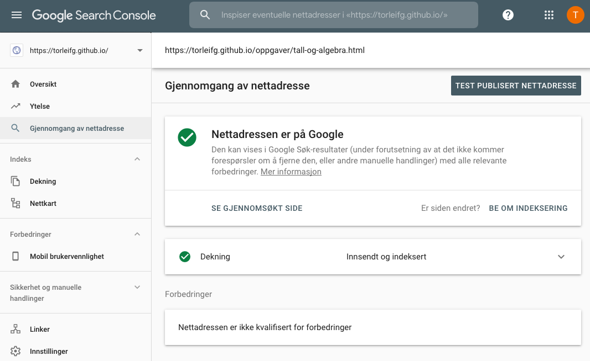
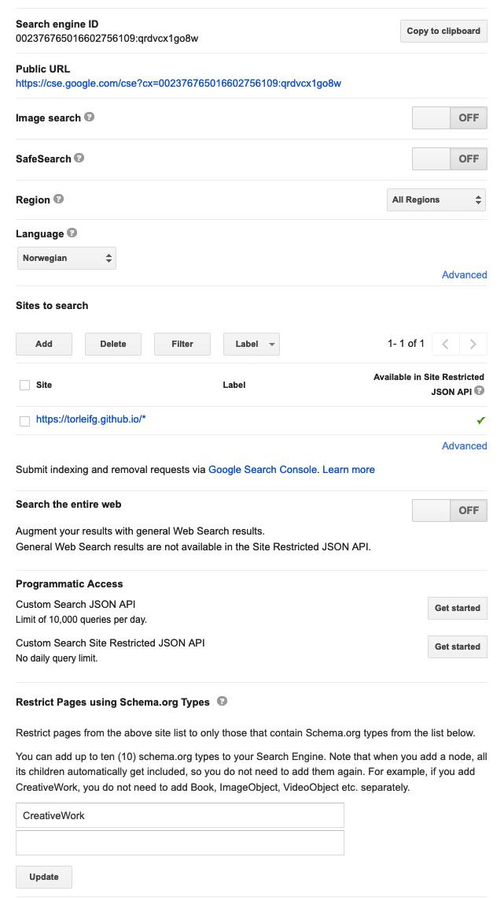
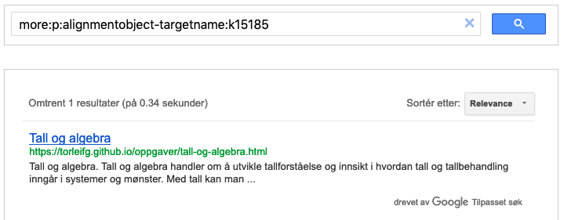

# Bruksområder
Bruksområder for NS4180 viser hvordan standarden kan danne grunnlag for tjenesteutvikling gjennom API-er, søkemotorer og så videre. 

## Innholdsfortegnelse
1.	[Tilpasset søkemotor og API](#soekemotor)  
	* 	1.1. [Strukturerte data (metadata)](#strukturerte-data) 
	* 	1.2. [Validering](#validering)
	*  	1.3. [Indeksering](#indeksering)
	*  	1.4. [Tilpasset søkemotor](#tilpasset-soekemotor)
	*  	1.5. [JSON API](#json-api)
2.	(...)

<a name="soekemotor"></a>
### 1. Tilpasset søkemotor og API
Hvordan lage en tilpasset søkemotor og få et API med på kjøpet. 

Dette er et eksempel på et bruksområde hvor en aktør jevnlig crawler et utvalg domener for ustrukturerte og strukturerte data om læringsressurser, indekserer dataene og tilbyr API-er hvor andre aktører kan hente ut dataene på strukturerte formater.  

Forutsetninger: Google-konto(**må**), domene(**bør**).

<a name="strukturerte-data"></a>
#### 1.1. Strukturerte data (metadata)
For at det skal være mulig å gjøre strukturerte søk etter læringsressurser må det legges inn strukturerte data eller metadata i selve ressursene eller i landingssider for ressursene. Strukturerte data bør være i henhold til NS4180 og benytte formatene [Microdata](https://www.w3.org/TR/microdata/) eller [RDFa](https://www.w3.org/TR/rdfa-lite/).

Eksempler på hvordan dette kan kodes, finnes [her](./eksempler.md).
 
<a name="validering"></a>
#### 1.2. Validering
Det er viktig at oppmerkingen av strukturerte data i ressursene validerer og har riktig struktur. [Testverktøy for strukturerte data](https://search.google.com/structured-data/testing-tool) kan benyttes til dette formålet.

Eksempel på hvordan et resultat bør se ut dersom det er i henhold til NS4180, finnes [her](https://search.google.com/structured-data/testing-tool#url=torleifg.github.io%2Foppgaver%2Ftall-og-algebra.html).

<a name="indeksering"></a>
#### 1.3. Indeksering
Google og andre store søkemotorer crawler og indekserer både ustrukturerte og strukturerte data på internett.

[Google søkekonsoll](https://search.google.com/search-console/about) er en tjeneste som gjør det mulig å overvåke og til en viss grad kontrollere indekseringen av et (sub)domene. Tilgang krever verifisering av eierskap til minst ett (sub)domene. Informasjon om ulike metoder for verifisering, finnes [her](https://support.google.com/webmasters/answer/9008080).



Det er også mulig å kjøre følgende spørring i Google `site:eksempeldomene.no` for å se hvilke ressurser som er indeksert under et gitt (sub)domene.

<a name="tilpasset-soekemotor"></a>
#### 1.4. Tilpasset søkemotor
Når ressursene er crawlet og indeksert vil de dukke opp i søkeresultater hos Google. 

[Tilpasset søkemotor](https://cse.google.com/cse/) er en tjeneste hvor alle kan opprette og utforme sin egen søkemotor. Tjenesten tilbyr et kraftig fritekstsøk kombinert med muligheten for å utføre strukturerte søk.



Det opprettes automatisk en offentlig URL hvor alle kan nå den tilpassede søkemotoren. Presentasjon eller visning av søkemotoren kan tilpasses ved hjelp av tjenesten over eller programmatisk ved hjelp av et dedikert [API](https://developers.google.com/custom-search/docs/element). 

I skjembilde under vises et eksempel på strukturert søk i en tilpasset søkemotor. Dokumentasjon av hvordan bygge strukturerte søk, finnes [her](https://developers.google.com/custom-search/docs/structured_search).



<a name="json-api"></a>
#### 1.5. JSON API
Med tilpasset søkemotor følger det også et JSON API. API gir programmatisk tilgang til en tilpasset søkemotor og større fleksibilitet med hensyn til forespørsler, svar og visning.     

Det må opprettes en `API-key` for å ta i bruk JSON API. Informasjon og fremgangsmåte, finnes [her](https://developers.google.com/custom-search/v1/introduction).

Dokumentasjon av API (detaljert beskrivelse av hvilke parametre som kan følge med forespørsler til API samt struktur på svar fra API) og sandkasse for utviklere, finnes [her](https://developers.google.com/custom-search/v1/cse/list).

Dokumentasjon av hvordan bygge strukturerte søk, finnes [her](https://developers.google.com/custom-search/docs/structured_search).

Påkrevde parametre for API er `cx` (Search engine ID), `key` (API-key) og `q` (query string).

**Eksempel** (forespørsel/request):

`curl 'https://www.googleapis.com/customsearch/v1?cx={Search engine ID}&key={API-key}&q={query}'`

**Eksempel** (svar/response):

```javascript
{
    "kind": "customsearch#search",
    "url": {
        "type": "application/json",
        "template": "https://www.googleapis.com/customsearch/v1?q={searchTerms}&num={count?}&start={startIndex?}&lr={language?}&safe={safe?}&cx={cx?}&sort={sort?}&filter={filter?}&gl={gl?}&cr={cr?}&googlehost={googleHost?}&c2coff={disableCnTwTranslation?}&hq={hq?}&hl={hl?}&siteSearch={siteSearch?}&siteSearchFilter={siteSearchFilter?}&exactTerms={exactTerms?}&excludeTerms={excludeTerms?}&linkSite={linkSite?}&orTerms={orTerms?}&relatedSite={relatedSite?}&dateRestrict={dateRestrict?}&lowRange={lowRange?}&highRange={highRange?}&searchType={searchType}&fileType={fileType?}&rights={rights?}&imgSize={imgSize?}&imgType={imgType?}&imgColorType={imgColorType?}&imgDominantColor={imgDominantColor?}&alt=json"
    },
    "queries": {
        "request": [
            {
                "title": "Google Custom Search - more:p:alignmentobject-targetname:K15185",
                "totalResults": "1",
                "searchTerms": "more:p:alignmentobject-targetname:K15185",
                "count": 1,
                "startIndex": 1,
                "inputEncoding": "utf8",
                "outputEncoding": "utf8",
                "safe": "off",
                "cx": "002376765016602756109:qrdvcx1go8w"
            }
        ]
    },
    "context": {
        "title": "ns4180"
    },
    "searchInformation": {
        "searchTime": 0.38978,
        "formattedSearchTime": "0,39",
        "totalResults": "1",
        "formattedTotalResults": "1"
    },
    "items": [
        {
            "kind": "customsearch#result",
            "title": "Tall og algebra",
            "htmlTitle": "Tall og algebra",
            "link": "https://torleifg.github.io/oppgaver/tall-og-algebra.html",
            "displayLink": "torleifg.github.io",
            "snippet": "Tall og algebra. Tall og algebra handler om å utvikle tallforståelse og innsikt i \nhvordan tall og tallbehandling inngår i systemer og mønster. Med tall kan man ...",
            "htmlSnippet": "Tall og algebra. Tall og algebra handler om å utvikle tallforståelse og innsikt i <br>\nhvordan tall og tallbehandling inngår i systemer og mønster. Med tall kan man&nbsp;...",
            "cacheId": "fsVePYci17gJ",
            "formattedUrl": "https://torleifg.github.io/oppgaver/tall-og-algebra.html",
            "htmlFormattedUrl": "https://torleifg.github.io/oppgaver/tall-og-algebra.html",
            "pagemap": {
                "alignmentobject": [
                    {
                        "alignmenttype": "assesses",
                        "educationalframework": "Kunnskapsløftet",
                        "targetdescription": "beskrive og bruke plassverdisystemet for desimaltal, rekne med positive og negative heile tal, desimaltal, brøkar og prosent og plassere dei ulike storleikane på tallina",
                        "targetname": "K15185",
                        "targeturl": "http://psi.udir.no/kl06/K15185"
                    },
                    {
                        "alignmenttype": "assesses",
                        "educationalframework": "Kunnskapsløftet",
                        "targetdescription": "utvikle, bruke og diskutere metodar for hovudrekning, overslagsrekning og skriftleg rekning og bruke digitale verktøy i berekningar",
                        "targetname": "K15186",
                        "targeturl": "http://psi.udir.no/kl06/K15186"
                    }
                ],
                "metatags": [
                    {
                        "viewport": "width=device-width, initial-scale=1, shrink-to-fit=no"
                    }
                ],
                "creativework": [
                    {
                        "name": "Eksempeloppgave i tall og algebra",
                        "datecreated": "2018-02-01",
                        "inlanguage": "no",
                        "license": "http://creativecommons.org/licenses/by-nc-nd/3.0/deed.no",
                        "educationaluse": "assessment",
                        "timerequired": "PT2M",
                        "typicalagerange": "10-12",
                        "interactivitytype": "active",
                        "learningresourcetype": "assessmentItem"
                    }
                ],
                "educationalaudience": [
                    {
                        "educationalrole": "student"
                    }
                ],
                "person": [
                    {
                        "givenname": "Gallus",
                        "familyname": "LeBeau"
                    }
                ],
                "organization": [
                    {
                        "legalname": "Dev Learning"
                    }
                ]
            }
        }
    ]
}
```